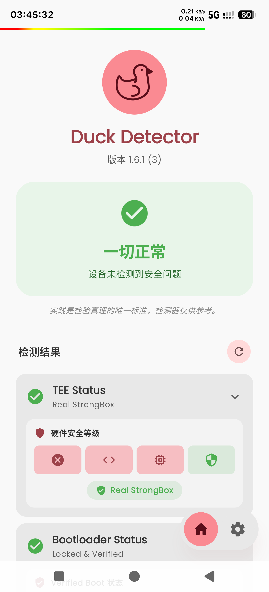
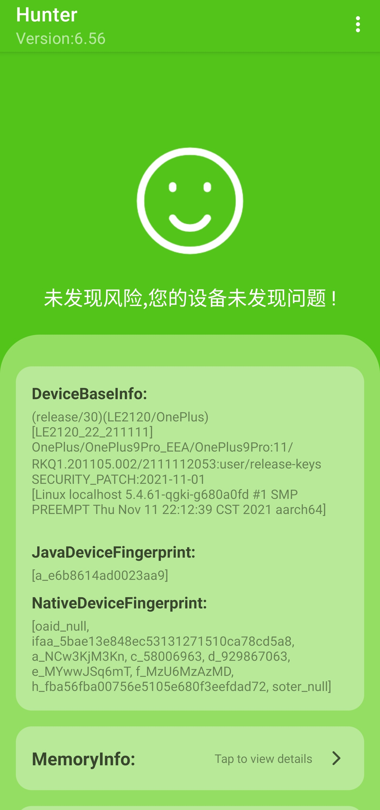

## Detectors

Momo $\rightarrow$ Native Root Detector $\rightarrow$ Native Test ++

### Android Integrity Checker

- **Package Name**: ``com.thend.integritychecker``
- **Official Link**: https://play.google.com/store/apps/details?id=com.thend.integritychecker
- **Developing Purpose**: Play Integrity Check
- **Latest Version**: ``v1.0.4 (1000004)``
- **Release Date**:  November 14th, 2023

### APTest

- **Package Name**: ``me.garfieldhan.hiapatch``
- **Source Status**: Closed-source
- **Developing Purpose**: Apatch Detection
- **Latest Version**: ``v1.0``
- **Release Date**: Before December 27th, 2024

### Applist Detector

- **Package Names**: ``icu.nullptr.applistdetector``; ``com.tsng.applistdetector``
- **Official Link**: https://github.com/Dr-TSNG/ApplistDetector
- **Source Status**: Open-source
- **Developing Purpose**: Applist Detection
- **Latest Version**: ``v2.4``
- **Release Date**:  August 12th, 2022
- **Detection Remark**: The package name ``com.tsng.applistdetector`` is a history name (about ``v1.3.2``). 
- 

### Bank of China (Hong Kong)

- **Package Name**: ``com.bochk.app.aos``
- **Official Link**: https://play.google.com/store/apps/details?id=com.bochk.app.aos
- **Source Status**: Android Desktop Application
- **Developing Purpose**: Android Desktop Application
- **Latest Version**: ``v7.3.5 (156)``
- **Release Date**:  September 20th, 2025

### Checker

- **Package Name**: ``org.akanework.checker``
- **Developing Purpose**: Environment Detection
- **Latest Version**: ``v1.0.9``
- **Release Date**: Before January 8th, 2025

### DRM Info

- **Package Name**: ``com.androidfung.drminfo``
- **Official Link**: https://play.google.com/store/apps/details?id=com.androidfung.drminfo
- **Developing Purpose**: Information Gathering
- **Latest Version**: ``v1.1.15-240919``
- **Release Date**:  September 19th, 2024
- **Detection Remark**: Please check whether the Security Level is Level 1. The smaller the level, the better the device is. 

### Duck Detector

- **Package Name**: ``com.studio.duckdetector``
- **Official Link**: The telegram channel is private. 
- **Developing Purpose**: Environment Detection
- **Latest Version**: ``v1.6.1-8d59eacb (3)``
- **Release Date**: Before December 20th, 2025

### Hunter

- **Package Name**: ``com.zhenxi.hunter``
- **Developing Purpose**: Environment Detection
- **Latest Version**: ``v6.56 (656)``
- **Release Date**: On or Before January 27th, 2026
- **Detection Remark**: Please wait about 20 seconds to complete the detection and display. On some occasions, the output of several specified issues will get loop. 

### IIQE 一考通

- **Alias**: IIQE YiKaoTong
- **Package Name**: ``com.prudential.iiqe``
- **Official Link**: https://iiqe-cms.prudential.com.hk/iiqe/
- **Source Status**: Android Desktop Application
- **Developing Purpose**: Android Desktop Application
- **Latest Version**: ``v6.4.3C88``
- **Release Date**:  March 3rd, 2025
- **Detection Remark**: This desktop application will detect the Developer Mode. 

### Luna

- **Package Name**: ``luna.safe.luna``
- **Official Links**: [https://www.54nb.com/lunathanks.html](https://www.54nb.com/lunathanks.html); [http://qm.qq.com/cgi-bin/qm/qr?_wv=1027&k=59DJwD_gUpDYerkoGXf8hLg4X-opZImm&authKey=KZCWgoCQMOhN5M80g8%2Bq3L%2FIJvITTMAKTSevEQbahYSW5YwlW8Vq8v6JQ4hcivfp&noverify=0&group_code=1022646824](http://qm.qq.com/cgi-bin/qm/qr?_wv=1027&k=59DJwD_gUpDYerkoGXf8hLg4X-opZImm&authKey=KZCWgoCQMOhN5M80g8%2Bq3L%2FIJvITTMAKTSevEQbahYSW5YwlW8Vq8v6JQ4hcivfp&noverify=0&group_code=1022646824)
- **Source Status**: Closed-source
- **Developing Purpose**: Environment Detection
- **Latest Version**: ``v1.4.2.7``
- **Release Date**: On or Before October 9th, 2025
- **Detection Remark**: This detector will detect the existence of a specific file or folder. You can use the cleanup script provided in the official link(s) to clean up. Since some plugins require specific directories to store their configurations without being able to specify custom directories, cleaning may result in configuration loss. Please use this detection software as appropriate. 

### Key Attestation

- **Package Name**: ``io.github.vvb2060.keyattestation``
- **Official Links**: [https://github.com/vvb2060/KeyAttestation](https://github.com/vvb2060/KeyAttestation); [https://t.me/magiskalpha](https://t.me/magiskalpha); [https://t.me/playintegrityfix](https://t.me/playintegrityfix); [https://github.com/chiteroman/KeyAttestation](https://github.com/chiteroman/KeyAttestation)
- **Source Status**: Open-source
- **Developing Purpose**: Key Attestation
- **Latest Version**: ``v1.8.4``
- **Release Date**:  February 6th, 2025

### Magisk Detector

- **Package Name**: ``io.github.vvb2060.magiskdetector``
- **Official Link**: https://github.com/vvb2060/MagiskDetector
- **Source Status**: Archieved & Open-source
- **Developing Purpose**: Magisk Detection
- **Latest Version**: ``v3.0``
- **Release Date**:  August 9th, 2022

### Momo

- **Package Name**: ``io.github.vvb2060.mahoshojo``
- **Developing Purpose**: Environment Detection
- **Latest Version**: ``v4.4.1``
- **Release Date**: Before January 7th, 2023
- **Detection Remark**: Please do not spoof this detector to get a happy face since spoofing detectors cannot essentially solve the environment issues. 

### Money2India

- **Package Name**: ``com.icicibank.m2i``
- **Official Link**: https://play.google.com/store/apps/details?id=com.icicibank.m2i
- **Source Status**: Android Desktop Application
- **Developing Purpose**: Android Desktop Application
- **Latest Version**: ``v1.0.73``
- **Release Date**:  December 22nd, 2024

### MyLink

- **Package Name**: ``com.ChinaMobile``
- **Official Link**: https://play.google.com/store/apps/details?id=com.ChinaMobile
- **Source Status**: Android Desktop Application
- **Developing Purpose**: Android Desktop Application
- **Latest Version**: ``v11.7.0 (465)``
- **Release Date**:  October 3rd, 2025

### NSDL Jiffy

- **Package Name**: ``com.nsdlpb.jiffy``
- **Official Link**: https://play.google.com/store/apps/details?id=com.nsdlpb.jiffy
- **Source Status**: Android Desktop Application
- **Developing Purpose**: Android Desktop Application
- **Latest Version**: ``v3.0.7``
- **Release Date**:  April 21st, 2025
- **Detection Remark**: This can be the most challenging one among all the detectors. 

### Native Root Detector

- **Alias**: Native Detector; Native Check
- **Package Name**: ``com.reveny.nativecheck``
- **Official Links**: [https://github.com/reveny/Android-Native-Root-Detector](https://github.com/reveny/Android-Native-Root-Detector); [https://t.me/rootdetector](https://t.me/rootdetector)
- **Source Status**: Open-source
- **Developing Purpose**: Environment Detection
- **Latest Version**: ``v7.6.1 (761)``
- **Release Date**:  September 15th, 2025
- **Detection Remark**: For the first time, please go to the settings page to enable the experimental detection and the custom ROM detection. Subsequently, re-launch the detector to show proper detection results. After changing environments or updating this detector, please be sure to completely uninstall the installed version before installing the detector to avoid the previous ``.odex`` affecting the detection results. 

### Native Test ++

- **Alias**: Native Test; Holmes
- **Package Names**: ``me.garfieldhan.holmes``; ``icu.nullptr.nativetest``; ``com.android.nativetest``
- **Official Link**: https://t.me/app_process64
- **Source Status**: Closed-source & For Sale
- **Developing Purpose**: Environment Detection
- **Latest Version**: ``v32 (Mean Minotaur)``
- **Release Date**: On or Before June 15th, 2025
- **Detection Remark**: Holmes and Native Test are integrated here. Some historical versions will crash on some devices (older versions of Holmes), report false positives (Native Test non-pure versions may mis-report Malicious Hook on some unrooted devices), and require network access (recent versions of Holmes). 
- 

### Octopus

- **Package Name**: ``com.octopuscards.nfc_reader``
- **Official Link**: https://play.google.com/store/apps/details?id=com.octopuscards.nfc_reader
- **Source Status**: Android Desktop Application
- **Developing Purpose**: Android Desktop Application
- **Latest Version**: ``v12.29.0 (3302)``
- **Release Date**:  October 2nd, 2025

### Play Integrity API Checker

- **Package Name**: ``gr.nikolasspyr.integritycheck``
- **Official Links**: [https://github.com/1nikolas/play-integrity-checker-app](https://github.com/1nikolas/play-integrity-checker-app); [https://play.google.com/store/apps/details?id=gr.nikolasspyr.integritycheck](https://play.google.com/store/apps/details?id=gr.nikolasspyr.integritycheck)
- **Source Status**: Open-source
- **Developing Purpose**: Play Integrity Check
- **Latest Version**: ``v2.2``
- **Release Date**: On or Before December 10th, 2025

### Revolut

- **Package Name**: ``com.revolut.revolut``
- **Official Link**: https://play.google.com/store/apps/details?id=com.revolut.revolut
- **Source Status**: Android Desktop Application
- **Developing Purpose**: Android Desktop Application
- **Latest Version**: ``v10.82 (1008204677)``
- **Release Date**:  June 2nd, 2025

### Rookie Detector

- **Package Name**: ``wu.Rookie.Detector``
- **Official Link**: http://qm.qq.com/cgi-bin/qm/qr?_wv=1027&k=59DJwD_gUpDYerkoGXf8hLg4X-opZImm&authKey=KZCWgoCQMOhN5M80g8%2Bq3L%2FIJvITTMAKTSevEQbahYSW5YwlW8Vq8v6JQ4hcivfp&noverify=0&group_code=1022646824
- **Source Status**: Closed-source
- **Developing Purpose**: Environment Detection
- **Latest Version**: ``v1.22 (12)``
- **Release Date**:  May 15th, 2025

### Ruru

- **Package Name**: ``com.byxiaorun.detector``
- **Official Link**: https://github.com/byxiaorun/Ruru
- **Source Status**: Open-source
- **Developing Purpose**: Environment Detection
- **Latest Version**: ``v1.1.1 (15)``
- **Release Date**:  April 18th, 2024

### Securify

- **Package Name**: ``io.github.rabehx.securify``
- **Official Link**: https://github.com/RabehX/Securify
- **Source Status**: Closed-source
- **Developing Purpose**: Environment Detection
- **Latest Version**: ``v1.3.0``
- **Release Date**:  July 28th, 2024
- 

### Simple Play Integrity Checker

- **Alias**: SPIC
- **Package Name**: ``com.henrikherzig.playintegritychecker``
- **Source Status**: Closed-source
- **Developing Purpose**: Play Integrity Check
- **Latest Version**: ``v1.4.0``
- **Release Date**: Before November 10th, 2024

### TamJiGi

- **Alias**: xka wl rl
- **Package Name**: ````
- **Source Status**: Closed-source
- **Developing Purpose**: Environment Detection
- **Latest Version**: ``v0.1.0 (46)``
- **Release Date**:  November 22nd, 2024
- 

### Uber Driver

- **Package Name**: ``com.ubercab.driver``
- **Official Link**: https://play.google.com/store/apps/details?id=com.ubercab.driver
- **Source Status**: Android Desktop Application
- **Developing Purpose**: Android Desktop Application
- **Latest Version**: ``v4.529.10000 (230434)``
- **Release Date**:  June 2nd, 2025

### Xposed Checker

- **Package Name**: ``ml.w568w.checkxposed``
- **Official Link**: https://github.com/w568w/XposedChecker
- **Source Status**: Open-source
- **Developing Purpose**: Environment Detection
- **Latest Version**: ``v7.1 (9)``
- **Release Date**: Before February 3rd, 2022

### Xposed Detector

- **Package Name**: ``io.github.vvb2060.xposeddetector``
- **Official Link**: https://github.com/vvb2060/XposedDetector
- **Source Status**: Archieved & Open-source
- **Developing Purpose**: Environment Detection
- **Latest Version**: ``v2.2 (5)``
- **Release Date**:  March 27th, 2021

### Yet Another SafetyNet Attestation Checker

- **Alias**: YASNAC
- **Package Name**: ``rikka.safetynetchecker``
- **Official Link**: https://github.com/RikkaW/YASNAC
- **Source Status**: Archieved & Open-source
- **Developing Purpose**: Play Integrity Check
- **Latest Version**: ``v1.1.5.r65.15110ef310 (65)``
- **Release Date**:  April 4th, 2022

### 凌卿检测

- **Alias**: LingQing Detector; Lingqing Detector
- **Package Name**: ``com.lingqing.detector``
- **Official Link**: http://qm.qq.com/cgi-bin/qm/qr?_wv=1027&k=59DJwD_gUpDYerkoGXf8hLg4X-opZImm&authKey=KZCWgoCQMOhN5M80g8%2Bq3L%2FIJvITTMAKTSevEQbahYSW5YwlW8Vq8v6JQ4hcivfp&noverify=0&group_code=1022646824
- **Source Status**: Closed-source
- **Developing Purpose**: Environment Detection
- **Latest Version**: ``v1.6_fix``
- **Release Date**:  June 6th, 2025

### 春秋检测

- **Package Name**: ``chunqiu.safe``
- **Official Links**: [http://qm.qq.com/cgi-bin/qm/qr?_wv=1027&k=sHROUm50OrgL5Ko16n5-jfl5sFwr-nbi&authKey=dXMNZRNFvGYMTF6GsDWHb2if5guBnkWOIuRyCAIA9OHf6wsntiMW%2BFJK6v5L6uGE&noverify=0&group_code=738834258](http://qm.qq.com/cgi-bin/qm/qr?_wv=1027&k=sHROUm50OrgL5Ko16n5-jfl5sFwr-nbi&authKey=dXMNZRNFvGYMTF6GsDWHb2if5guBnkWOIuRyCAIA9OHf6wsntiMW%2BFJK6v5L6uGE&noverify=0&group_code=738834258); [https://pan.xunlei.com/s/VOSCXZEqHQ_1l5vJgWWrulefA1?pwd=pdg6&path=%2F%E6%98%A5%E7%A7%8B%E6%A3%80%E6%B5%8B%E5%AE%98%E6%96%B9%E7%BD%91%E7%9B%98](https://pan.xunlei.com/s/VOSCXZEqHQ_1l5vJgWWrulefA1?pwd=pdg6&path=%2F%E6%98%A5%E7%A7%8B%E6%A3%80%E6%B5%8B%E5%AE%98%E6%96%B9%E7%BD%91%E7%9B%98); [http://qm.qq.com/cgi-bin/qm/qr?_wv=1027&k=59DJwD_gUpDYerkoGXf8hLg4X-opZImm&authKey=KZCWgoCQMOhN5M80g8%2Bq3L%2FIJvITTMAKTSevEQbahYSW5YwlW8Vq8v6JQ4hcivfp&noverify=0&group_code=1022646824](http://qm.qq.com/cgi-bin/qm/qr?_wv=1027&k=59DJwD_gUpDYerkoGXf8hLg4X-opZImm&authKey=KZCWgoCQMOhN5M80g8%2Bq3L%2FIJvITTMAKTSevEQbahYSW5YwlW8Vq8v6JQ4hcivfp&noverify=0&group_code=1022646824)
- **Source Status**: Closed-source
- **Developing Purpose**: Environment Detection
- **Latest Version**: ``v2.5.2 (25080401)``
- **Release Date**:  August 4th, 2025
- **Detection Remark**: This detector only supports Android 12 or above since ``v2.2``. Use the tools provided in the official link(s) to bypass if necessary. 

### 橘子环境检测内测

- **Package Name**: ``com.OrangeEnvironment.Detector``
- **Official Link**: http://qm.qq.com/cgi-bin/qm/qr?_wv=1027&k=59DJwD_gUpDYerkoGXf8hLg4X-opZImm&authKey=KZCWgoCQMOhN5M80g8%2Bq3L%2FIJvITTMAKTSevEQbahYSW5YwlW8Vq8v6JQ4hcivfp&noverify=0&group_code=1022646824
- **Source Status**: Closed-source
- **Developing Purpose**: Environment Detection
- **Latest Version**: ``v3.0``
- **Release Date**:  June 9th, 2025

### 禁用安全标志检测器

- **Package Name**: ``io.github.a13e300.dsf_detector``
- **Official Links**: [https://github.com/a13e300/dsf_detector](https://github.com/a13e300/dsf_detector); [http://qm.qq.com/cgi-bin/qm/qr?_wv=1027&k=59DJwD_gUpDYerkoGXf8hLg4X-opZImm&authKey=KZCWgoCQMOhN5M80g8%2Bq3L%2FIJvITTMAKTSevEQbahYSW5YwlW8Vq8v6JQ4hcivfp&noverify=0&group_code=1022646824](http://qm.qq.com/cgi-bin/qm/qr?_wv=1027&k=59DJwD_gUpDYerkoGXf8hLg4X-opZImm&authKey=KZCWgoCQMOhN5M80g8%2Bq3L%2FIJvITTMAKTSevEQbahYSW5YwlW8Vq8v6JQ4hcivfp&noverify=0&group_code=1022646824)
- **Source Status**: Closed-source
- **Developing Purpose**: Flag Detection
- **Latest Version**: ``v1.0.3 (5)``
- **Release Date**:  June 9th, 2025

### 邮储银行

- **Alias**: Postal Savings Bank of China; PSBC
- **Package Name**: ``com.yitong.mbank.psbc``
- **Official Link**: https://phone.psbc.com
- **Source Status**: Android Desktop Application
- **Developing Purpose**: Android Desktop Application
- **Latest Version**: ``v10.5.2 (188)``
- **Release Date**:  June 4th, 2025


---

## 检测软件

Momo $\rightarrow$ Native Root Detector $\rightarrow$ 牛头人

### Android Integrity Checker

- **应用包名**：``com.thend.integritychecker``
- **官方链接**：[https://play.google.com/store/apps/details?id=com.thend.integritychecker](https://play.google.com/store/apps/details?id=com.thend.integritychecker)
- **开发用途**：Play 完整性检测
- **最新版本**：``v1.0.4 (1000004)``
- **发行日期**： 2023 年 11 月 14 日

### APTest

- **应用包名**：``me.garfieldhan.hiapatch``
- **开源状态**：闭源
- **开发用途**：Apatch 检测
- **最新版本**：``v1.0``
- **发行日期**：早于 2024 年 12 月 27 日

### Applist Detector

- **应用别称**：应用列表检测; 检测应用列表
- **应用包名**：``icu.nullptr.applistdetector``；``com.tsng.applistdetector``
- **官方链接**：[https://github.com/Dr-TSNG/ApplistDetector](https://github.com/Dr-TSNG/ApplistDetector)
- **开源状态**：开源
- **开发用途**：应用列表检测
- **最新版本**：``v2.4``
- **发行日期**： 2022 年 8 月 12 日
- **检测备注**：包名 ``com.tsng.applistdetector`` 是历史版本包名（约 ``v1.3.2``）。
- 

### Bank of China (Hong Kong)

- **应用别称**：BOCHK中银香港; 中国银行（香港）; 中银香港
- **应用包名**：``com.bochk.app.aos``
- **官方链接**：[https://play.google.com/store/apps/details?id=com.bochk.app.aos](https://play.google.com/store/apps/details?id=com.bochk.app.aos)
- **开源状态**：安卓桌面应用
- **开发用途**：安卓桌面应用
- **最新版本**：``v7.3.5 (156)``
- **发行日期**： 2025 年 9 月 20 日

### Checker

- **应用别称**：校验者
- **应用包名**：``org.akanework.checker``
- **开发用途**：环境检测
- **最新版本**：``v1.0.9``
- **发行日期**：早于 2025 年 1 月 8 日
- 

### DRM Info

- **应用包名**：``com.androidfung.drminfo``
- **官方链接**：[https://play.google.com/store/apps/details?id=com.androidfung.drminfo](https://play.google.com/store/apps/details?id=com.androidfung.drminfo)
- **开发用途**：信息收集
- **最新版本**：``v1.1.15-240919``
- **发行日期**： 2024 年 9 月 19 日
- **检测备注**：请检查 Security Level 是否为 L1，等级数值越小越好。

### Duck Detector

- **应用包名**：``com.studio.duckdetector``
- **官方链接**：[The telegram channel is private. ](The telegram channel is private. )
- **开发用途**：环境检测
- **最新版本**：``v1.6.1-8d59eacb (3)``
- **发行日期**：早于 2025 年 12 月 20 日
- 

### Hunter

- **应用包名**：``com.zhenxi.hunter``
- **开发用途**：环境检测
- **最新版本**：``v6.56 (656)``
- **发行日期**：不晚于 2026 年 1 月 27 日
- **检测备注**：请等待 20 秒左右以完成检测和显示，某些情况下可能会一直输出某几个问题。
- 

### IIQE 一考通

- **应用包名**：``com.prudential.iiqe``
- **官方链接**：[https://iiqe-cms.prudential.com.hk/iiqe/](https://iiqe-cms.prudential.com.hk/iiqe/)
- **开源状态**：安卓桌面应用
- **开发用途**：安卓桌面应用
- **最新版本**：``v6.4.3C88``
- **发行日期**： 2025 年 3 月 3 日
- **检测备注**：该桌面应用会检测开发者模式。

### Luna

- **应用包名**：``luna.safe.luna``
- **官方链接**：[https://www.54nb.com/lunathanks.html](https://www.54nb.com/lunathanks.html)；[http://qm.qq.com/cgi-bin/qm/qr?_wv=1027&k=59DJwD_gUpDYerkoGXf8hLg4X-opZImm&authKey=KZCWgoCQMOhN5M80g8%2Bq3L%2FIJvITTMAKTSevEQbahYSW5YwlW8Vq8v6JQ4hcivfp&noverify=0&group_code=1022646824](http://qm.qq.com/cgi-bin/qm/qr?_wv=1027&k=59DJwD_gUpDYerkoGXf8hLg4X-opZImm&authKey=KZCWgoCQMOhN5M80g8%2Bq3L%2FIJvITTMAKTSevEQbahYSW5YwlW8Vq8v6JQ4hcivfp&noverify=0&group_code=1022646824)
- **开源状态**：闭源
- **开发用途**：环境检测
- **最新版本**：``v1.4.2.7``
- **发行日期**：不晚于 2025 年 10 月 9 日
- **检测备注**：该应用会检测特定文件或文件夹是否存在，可以使用官方链接中提供的清理脚本进行清理。由于某些插件需要使用特定目录来存放配置数据且未提供自定义目录功能，清理可能会导致配置丢失，请酌情使用本检测软件。
- 

### Key Attestation

- **应用别称**：密钥认证
- **应用包名**：``io.github.vvb2060.keyattestation``
- **官方链接**：[https://github.com/vvb2060/KeyAttestation](https://github.com/vvb2060/KeyAttestation)；[https://t.me/magiskalpha](https://t.me/magiskalpha)；[https://t.me/playintegrityfix](https://t.me/playintegrityfix)；[https://github.com/chiteroman/KeyAttestation](https://github.com/chiteroman/KeyAttestation)
- **开源状态**：开源
- **开发用途**：密钥认证
- **最新版本**：``v1.8.4``
- **发行日期**： 2025 年 2 月 6 日
- 

### Magisk Detector

- **应用别称**：Magisk 检测应用
- **应用包名**：``io.github.vvb2060.magiskdetector``
- **官方链接**：[https://github.com/vvb2060/MagiskDetector](https://github.com/vvb2060/MagiskDetector)
- **开源状态**：已存档 & 开源
- **开发用途**：面具检测
- **最新版本**：``v3.0``
- **发行日期**： 2022 年 8 月 9 日
- 

### Momo

- **应用别称**：陌陌
- **应用包名**：``io.github.vvb2060.mahoshojo``
- **开发用途**：环境检测
- **最新版本**：``v4.4.1``
- **发行日期**：早于 2023 年 1 月 7 日
- **检测备注**：请不要为了得到一张笑脸而欺骗该检测软件，因为欺骗某一个检测软件并不能从本质上解决环境问题。
- 

### Money2India

- **应用包名**：``com.icicibank.m2i``
- **官方链接**：[https://play.google.com/store/apps/details?id=com.icicibank.m2i](https://play.google.com/store/apps/details?id=com.icicibank.m2i)
- **开源状态**：安卓桌面应用
- **开发用途**：安卓桌面应用
- **最新版本**：``v1.0.73``
- **发行日期**： 2024 年 12 月 22 日

### MyLink

- **应用别称**：八达通
- **应用包名**：``com.ChinaMobile``
- **官方链接**：[https://play.google.com/store/apps/details?id=com.ChinaMobile](https://play.google.com/store/apps/details?id=com.ChinaMobile)
- **开源状态**：安卓桌面应用
- **开发用途**：安卓桌面应用
- **最新版本**：``v11.7.0 (465)``
- **发行日期**： 2025 年 10 月 3 日

### NSDL Jiffy

- **应用包名**：``com.nsdlpb.jiffy``
- **官方链接**：[https://play.google.com/store/apps/details?id=com.nsdlpb.jiffy](https://play.google.com/store/apps/details?id=com.nsdlpb.jiffy)
- **开源状态**：安卓桌面应用
- **开发用途**：安卓桌面应用
- **最新版本**：``v3.0.7``
- **发行日期**： 2025 年 4 月 21 日
- **检测备注**：这应该是目前最难以绕过的检测。

### Native Root Detector

- **应用别称**：Native Detector; Native Check
- **应用包名**：``com.reveny.nativecheck``
- **官方链接**：[https://github.com/reveny/Android-Native-Root-Detector](https://github.com/reveny/Android-Native-Root-Detector)；[https://t.me/rootdetector](https://t.me/rootdetector)
- **开源状态**：开源
- **开发用途**：环境检测
- **最新版本**：``v7.6.1 (761)``
- **发行日期**： 2025 年 9 月 15 日
- **检测备注**：首次使用时请前往设置页面启用实验性检测和自定义 ROM 检测，随后重新启动该检测工具进行检测。在更改环境或更新该检测工具后，请务必在将已安装版本卸载干净后重新安装该检测工具以避免原有的 ``.odex`` 文件影响检测结果。
- 

### Native Test ++

- **应用别称**：Native Test; Holmes; 牛头; 牛头人; 牛头测试; 福尔摩斯
- **应用包名**：``me.garfieldhan.holmes``；``icu.nullptr.nativetest``；``com.android.nativetest``
- **官方链接**：[https://t.me/app_process64](https://t.me/app_process64)
- **开源状态**：闭源 & 销售中
- **开发用途**：环境检测
- **最新版本**：``v32 (Mean Minotaur)``
- **发行日期**：不晚于 2025 年 6 月 15 日
- **检测备注**：此处对 Holmes 和 Native Test 做了整合，部分历史版本会在一些设备上闪退（Holmes 旧版）、假阳性（Native Test 非 Pure 版本在某些没有 root 或注入环境的设备上误报 Malicious Hook）和需要联网权限（Holmes 最近的几个版本）。
- 

### Octopus

- **应用别称**：八达通
- **应用包名**：``com.octopuscards.nfc_reader``
- **官方链接**：[https://play.google.com/store/apps/details?id=com.octopuscards.nfc_reader](https://play.google.com/store/apps/details?id=com.octopuscards.nfc_reader)
- **开源状态**：安卓桌面应用
- **开发用途**：安卓桌面应用
- **最新版本**：``v12.29.0 (3302)``
- **发行日期**： 2025 年 10 月 2 日

### Play Integrity API Checker

- **应用包名**：``gr.nikolasspyr.integritycheck``
- **官方链接**：[https://github.com/1nikolas/play-integrity-checker-app](https://github.com/1nikolas/play-integrity-checker-app)；[https://play.google.com/store/apps/details?id=gr.nikolasspyr.integritycheck](https://play.google.com/store/apps/details?id=gr.nikolasspyr.integritycheck)
- **开源状态**：开源
- **开发用途**：Play 完整性检测
- **最新版本**：``v2.2``
- **发行日期**：不晚于 2025 年 12 月 10 日

### Revolut

- **应用包名**：``com.revolut.revolut``
- **官方链接**：[https://play.google.com/store/apps/details?id=com.revolut.revolut](https://play.google.com/store/apps/details?id=com.revolut.revolut)
- **开源状态**：安卓桌面应用
- **开发用途**：安卓桌面应用
- **最新版本**：``v10.82 (1008204677)``
- **发行日期**： 2025 年 6 月 2 日

### Rookie Detector

- **应用包名**：``wu.Rookie.Detector``
- **官方链接**：[http://qm.qq.com/cgi-bin/qm/qr?_wv=1027&k=59DJwD_gUpDYerkoGXf8hLg4X-opZImm&authKey=KZCWgoCQMOhN5M80g8%2Bq3L%2FIJvITTMAKTSevEQbahYSW5YwlW8Vq8v6JQ4hcivfp&noverify=0&group_code=1022646824](http://qm.qq.com/cgi-bin/qm/qr?_wv=1027&k=59DJwD_gUpDYerkoGXf8hLg4X-opZImm&authKey=KZCWgoCQMOhN5M80g8%2Bq3L%2FIJvITTMAKTSevEQbahYSW5YwlW8Vq8v6JQ4hcivfp&noverify=0&group_code=1022646824)
- **开源状态**：闭源
- **开发用途**：环境检测
- **最新版本**：``v1.22 (12)``
- **发行日期**： 2025 年 5 月 15 日

### Ruru

- **应用包名**：``com.byxiaorun.detector``
- **官方链接**：[https://github.com/byxiaorun/Ruru](https://github.com/byxiaorun/Ruru)
- **开源状态**：开源
- **开发用途**：环境检测
- **最新版本**：``v1.1.1 (15)``
- **发行日期**： 2024 年 4 月 18 日
- 

### Securify

- **应用包名**：``io.github.rabehx.securify``
- **官方链接**：[https://github.com/RabehX/Securify](https://github.com/RabehX/Securify)
- **开源状态**：闭源
- **开发用途**：环境检测
- **最新版本**：``v1.3.0``
- **发行日期**： 2024 年 7 月 28 日
- 

### Simple Play Integrity Checker

- **应用别称**：SPIC
- **应用包名**：``com.henrikherzig.playintegritychecker``
- **开源状态**：闭源
- **开发用途**：Play 完整性检测
- **最新版本**：``v1.4.0``
- **发行日期**：早于 2024 年 11 月 10 日

### TamJiGi

- **应用别称**：xka wl rl
- **应用包名**：````
- **开源状态**：闭源
- **开发用途**：环境检测
- **最新版本**：``v0.1.0 (46)``
- **发行日期**： 2024 年 11 月 22 日
- 

### Uber Driver

- **应用包名**：``com.ubercab.driver``
- **官方链接**：[https://play.google.com/store/apps/details?id=com.ubercab.driver](https://play.google.com/store/apps/details?id=com.ubercab.driver)
- **开源状态**：安卓桌面应用
- **开发用途**：安卓桌面应用
- **最新版本**：``v4.529.10000 (230434)``
- **发行日期**： 2025 年 6 月 2 日

### Xposed Checker

- **应用包名**：``ml.w568w.checkxposed``
- **官方链接**：[https://github.com/w568w/XposedChecker](https://github.com/w568w/XposedChecker)
- **开源状态**：开源
- **开发用途**：环境检测
- **最新版本**：``v7.1 (9)``
- **发行日期**：早于 2022 年 2 月 3 日
- 

### Xposed Detector

- **应用别称**：Xposed 检测应用
- **应用包名**：``io.github.vvb2060.xposeddetector``
- **官方链接**：[https://github.com/vvb2060/XposedDetector](https://github.com/vvb2060/XposedDetector)
- **开源状态**：已存档 & 开源
- **开发用途**：环境检测
- **最新版本**：``v2.2 (5)``
- **发行日期**： 2021 年 3 月 27 日
- 

### Yet Another SafetyNet Attestation Checker

- **应用别称**：YASNAC
- **应用包名**：``rikka.safetynetchecker``
- **官方链接**：[https://github.com/RikkaW/YASNAC](https://github.com/RikkaW/YASNAC)
- **开源状态**：已存档 & 开源
- **开发用途**：Play 完整性检测
- **最新版本**：``v1.1.5.r65.15110ef310 (65)``
- **发行日期**： 2022 年 4 月 4 日

### 凌卿检测

- **应用别称**：凌卿
- **应用包名**：``com.lingqing.detector``
- **官方链接**：[http://qm.qq.com/cgi-bin/qm/qr?_wv=1027&k=59DJwD_gUpDYerkoGXf8hLg4X-opZImm&authKey=KZCWgoCQMOhN5M80g8%2Bq3L%2FIJvITTMAKTSevEQbahYSW5YwlW8Vq8v6JQ4hcivfp&noverify=0&group_code=1022646824](http://qm.qq.com/cgi-bin/qm/qr?_wv=1027&k=59DJwD_gUpDYerkoGXf8hLg4X-opZImm&authKey=KZCWgoCQMOhN5M80g8%2Bq3L%2FIJvITTMAKTSevEQbahYSW5YwlW8Vq8v6JQ4hcivfp&noverify=0&group_code=1022646824)
- **开源状态**：闭源
- **开发用途**：环境检测
- **最新版本**：``v1.6_fix``
- **发行日期**： 2025 年 6 月 6 日

### 春秋检测

- **应用别称**：春秋
- **应用包名**：``chunqiu.safe``
- **官方链接**：[http://qm.qq.com/cgi-bin/qm/qr?_wv=1027&k=sHROUm50OrgL5Ko16n5-jfl5sFwr-nbi&authKey=dXMNZRNFvGYMTF6GsDWHb2if5guBnkWOIuRyCAIA9OHf6wsntiMW%2BFJK6v5L6uGE&noverify=0&group_code=738834258](http://qm.qq.com/cgi-bin/qm/qr?_wv=1027&k=sHROUm50OrgL5Ko16n5-jfl5sFwr-nbi&authKey=dXMNZRNFvGYMTF6GsDWHb2if5guBnkWOIuRyCAIA9OHf6wsntiMW%2BFJK6v5L6uGE&noverify=0&group_code=738834258)；[https://pan.xunlei.com/s/VOSCXZEqHQ_1l5vJgWWrulefA1?pwd=pdg6&path=%2F%E6%98%A5%E7%A7%8B%E6%A3%80%E6%B5%8B%E5%AE%98%E6%96%B9%E7%BD%91%E7%9B%98](https://pan.xunlei.com/s/VOSCXZEqHQ_1l5vJgWWrulefA1?pwd=pdg6&path=%2F%E6%98%A5%E7%A7%8B%E6%A3%80%E6%B5%8B%E5%AE%98%E6%96%B9%E7%BD%91%E7%9B%98)；[http://qm.qq.com/cgi-bin/qm/qr?_wv=1027&k=59DJwD_gUpDYerkoGXf8hLg4X-opZImm&authKey=KZCWgoCQMOhN5M80g8%2Bq3L%2FIJvITTMAKTSevEQbahYSW5YwlW8Vq8v6JQ4hcivfp&noverify=0&group_code=1022646824](http://qm.qq.com/cgi-bin/qm/qr?_wv=1027&k=59DJwD_gUpDYerkoGXf8hLg4X-opZImm&authKey=KZCWgoCQMOhN5M80g8%2Bq3L%2FIJvITTMAKTSevEQbahYSW5YwlW8Vq8v6JQ4hcivfp&noverify=0&group_code=1022646824)
- **开源状态**：闭源
- **开发用途**：环境检测
- **最新版本**：``v2.5.2 (25080401)``
- **发行日期**： 2025 年 8 月 4 日
- **检测备注**：从 ``v2.2`` 版本开始仅支持安卓 12 及以上。如有需要，请使用官方链接中提供的工具。

### 橘子环境检测内测

- **应用别称**：橘子
- **应用包名**：``com.OrangeEnvironment.Detector``
- **官方链接**：[http://qm.qq.com/cgi-bin/qm/qr?_wv=1027&k=59DJwD_gUpDYerkoGXf8hLg4X-opZImm&authKey=KZCWgoCQMOhN5M80g8%2Bq3L%2FIJvITTMAKTSevEQbahYSW5YwlW8Vq8v6JQ4hcivfp&noverify=0&group_code=1022646824](http://qm.qq.com/cgi-bin/qm/qr?_wv=1027&k=59DJwD_gUpDYerkoGXf8hLg4X-opZImm&authKey=KZCWgoCQMOhN5M80g8%2Bq3L%2FIJvITTMAKTSevEQbahYSW5YwlW8Vq8v6JQ4hcivfp&noverify=0&group_code=1022646824)
- **开源状态**：闭源
- **开发用途**：环境检测
- **最新版本**：``v3.0``
- **发行日期**： 2025 年 6 月 9 日

### 禁用安全标志检测器

- **应用包名**：``io.github.a13e300.dsf_detector``
- **官方链接**：[https://github.com/a13e300/dsf_detector](https://github.com/a13e300/dsf_detector)；[http://qm.qq.com/cgi-bin/qm/qr?_wv=1027&k=59DJwD_gUpDYerkoGXf8hLg4X-opZImm&authKey=KZCWgoCQMOhN5M80g8%2Bq3L%2FIJvITTMAKTSevEQbahYSW5YwlW8Vq8v6JQ4hcivfp&noverify=0&group_code=1022646824](http://qm.qq.com/cgi-bin/qm/qr?_wv=1027&k=59DJwD_gUpDYerkoGXf8hLg4X-opZImm&authKey=KZCWgoCQMOhN5M80g8%2Bq3L%2FIJvITTMAKTSevEQbahYSW5YwlW8Vq8v6JQ4hcivfp&noverify=0&group_code=1022646824)
- **开源状态**：闭源
- **开发用途**：安全标志检测
- **最新版本**：``v1.0.3 (5)``
- **发行日期**： 2025 年 6 月 9 日

### 邮储银行

- **应用别称**：中国邮储银行
- **应用包名**：``com.yitong.mbank.psbc``
- **官方链接**：[https://phone.psbc.com](https://phone.psbc.com)
- **开源状态**：安卓桌面应用
- **开发用途**：安卓桌面应用
- **最新版本**：``v10.5.2 (188)``
- **发行日期**： 2025 年 6 月 4 日

